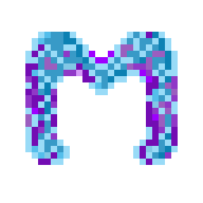

  
  

 

# 🎮 MeroHoster & MeroClient
**MeroHoster** is a modern, lightweight, and powerful Minecraft server hosting wrapper. It provides a beautiful web-based interface to manage your Minecraft servers effortlessly, removing the headache of command-line setups and port-forwarding.

**MeroClient** allows players to join via the invite code and sets up everything for them. ONLY WORKS WITH MERO P2P!

---

## ✨ Features (MeroHoster)
- **Beautiful Web Interface:** Manage everything from a modern, responsive dashboard with a premium Dark Mode design.
- **Smart Dependency-Aware Mod Updater:** One-click updates for your mods. A built-in constraint solver guarantees that your mods update safely without breaking dependencies!
- **One-Click Tunnels (Playit.gg & Mero P2P):** Automatically expose your server to the world without ever touching your router's port-forwarding settings. 
- **Modrinth & Curseforge Installer:** Search, download, and install plugins and mods directly from the dashboard.
- **Live Resource Monitoring:** Keep an eye on CPU and RAM usage in real-time.
- **Automated Backups:** Never lose your world again with built-in backup management.
- **Built-in Console:** Send commands, read server logs, and chat instantly from your browser.
- **Mero Multi-Host:** Seamlessly run and manage the exact same server from multiple different places (distributed shared hosting).

---

## ✨ Features (MeroClient)
- **Automatic Sync:** One-click delta-syncs for mods, shaderpacks, and resourcepacks.
- **Developer Mode:** Power users can enable Developer Mode to access the **Structured Manifest Viewer** and the **View Changes** split-screen diff UI, complete with a Changelog generator.
- **Auto-Updater:** The client automatically patches itself, so you never have to reinstall.

---

## 🚀 How to Host a Server (For the Host)
To run the server and access the web dashboard:

1. Go to the **Releases** tab on the right side of this GitHub page.
2. Download the latest `MeroHoster_Setup.exe`.
3. Run the installer wizard to install MeroHoster on your PC.
4. Launch MeroHoster from your new Desktop shortcut or Start Menu!
5. Click `Create Server` to create a new server. *(Pro tip: You can also just right-click any existing Minecraft server folder on your PC and select **"Open Server in MeroHoster"** to magically import it!)*
6. Choose a name and/or a description, select the connection method, the platform and version, and select the amount of RAM utilized by the server.
7. Once you're done, click Create.
8. You'll be redirected to the setup guide and greeted by a quick tutorial.
9. Once the tutorial is completed, click the `Start` button on the top to start the server for the first time.

---

## 🎮 How to Join the Server (For Players)
*__Players__* do **not** need to download the source code, run any commands, or use MeroHoster. Instead, they just use the custom **MeroClient**.

1. Go to the **Releases** tab on the right side of this GitHub page.
2. Download the latest `MeroClient_Installer.exe`.
3. Run the setup wizard to fully install MeroClient on your PC. (It includes an auto-updater, so you only have to install it once!)
4. Open MeroClient from your Desktop. Click __*`Add Server`*__, paste the Invite code provided by the server host in the box and click *__Check__*.
5. If the Code is valid, browse to your corresponding instance folder. 
   - *5.5 (Optional)*: If you can't run resourcepacks and shaders, or just want to have your own, uncheck the boxes above.
6. Click *Sync & Connect*. The app will configure the world, install any mods (if available), and connect you.
7. IMPORTANT: Once you connect, copy the code, BUT DO NOT LEAVE THE APP FOR THE CONNECTION TO STAY.

---

## 🛠️ Technology Stack
* **Backend:** Python (FastAPI, Uvicorn)
* **Frontend:** Vanilla HTML, CSS, JavaScript (Lucide Icons, Chart.js)
* **Tunneling:** Playit.gg Integration, Custom Mero P2P Tunnel
* **Client:** Python (Custom Minecraft Launcher wrapper with CustomTkinter UI)

---

## 📞 Contact
*If you want to make a deal or something important, reach out here:*
* **Discord:** `@barhoumthebest`

---
*Made with ❤️ by iamthebestcoderalive*
